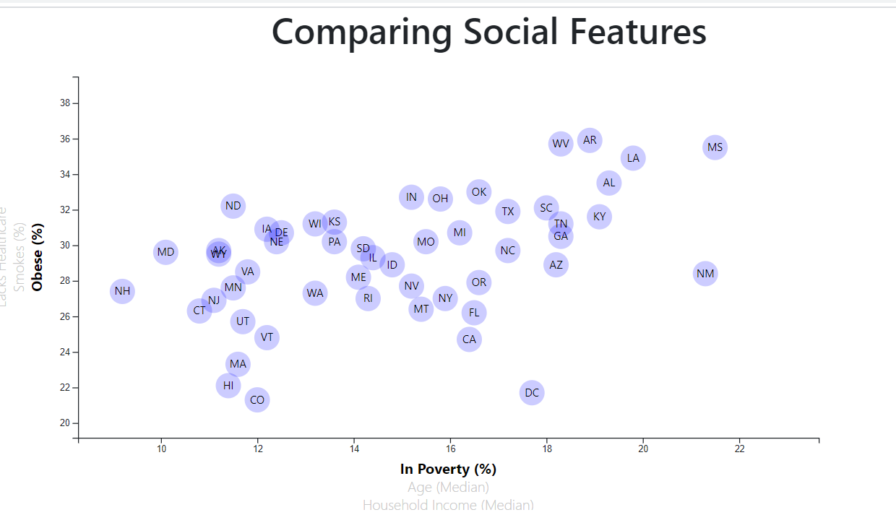

# D3_data_journalism

### Comparing Social Features

This page displays an interactive graph that looks the percentage of those with healthcare, those who smoke, and those who are obese against the percentage of those in poverty, the median age, and the median household income.

# Link to Page
https://preft.github.io/Social-Features-Analysis-D3/

# Visual Example:

